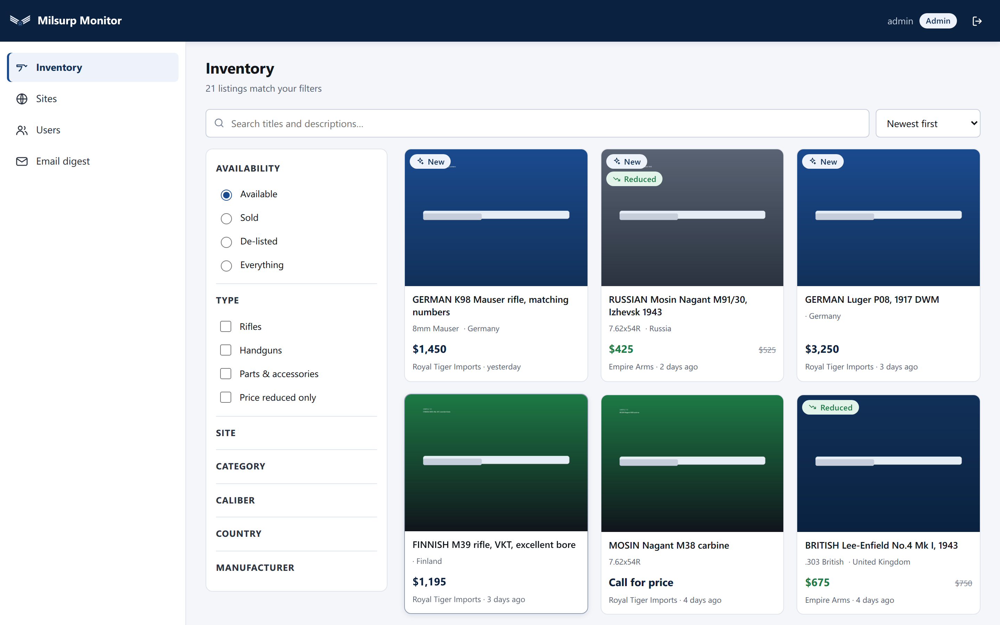
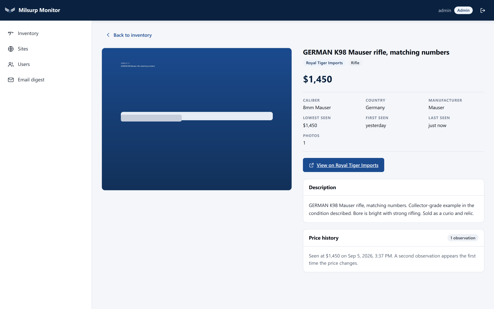
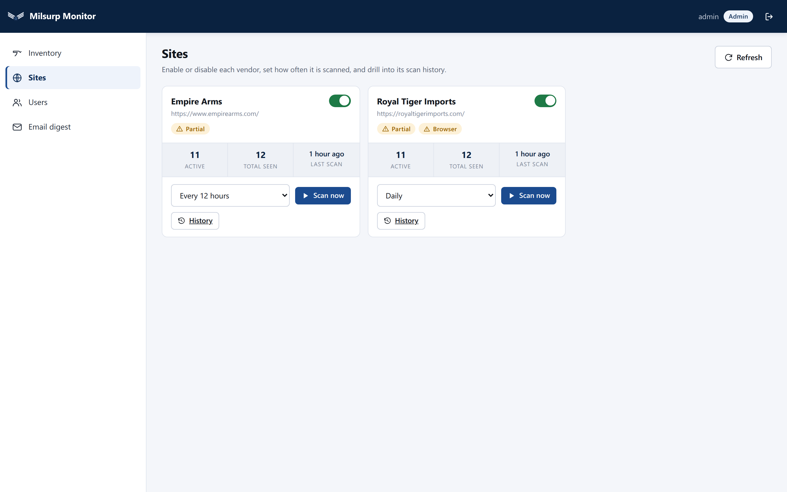
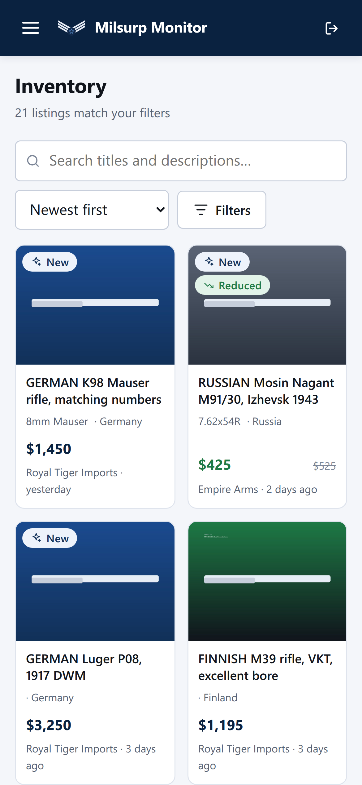

<div align="center">


# Milsurp Monitor

**Track military surplus firearm listings and price history across every vendor
site, from one place.**

[](#testing)
[](#testing)
[](LICENSE)
[](https://www.python.org/)
[](https://react.dev/)

</div>

---

Collector-grade surplus turns up on a dozen different dealer sites, each with
its own layout, its own idea of pagination, and no notification when something
new appears or a price drops. Milsurp Monitor crawls them all on a schedule,
keeps a full price history for every listing, and emails you a digest of what
changed — filtered to the sites you care about and capped so it stays readable.

## Contents

- [What it does](#what-it-does)
- [Screenshots](#screenshots)
- [How it works](#how-it-works)
- [Quick start (development)](#quick-start-development)
- [Production install](#production-install)
- [Configuration](#configuration)
- [Make targets](#make-targets)
- [Adding a vendor site](#adding-a-vendor-site)
- [Testing](#testing)
- [Security](#security)
- [Project layout](#project-layout)
- [Roadmap](#roadmap)

---

## What it does

### Crawling

- **Pluggable scrapers.** Each vendor is one class; scheduling, admin controls,
  price history, images and digests are all site-agnostic.
- **Handles hostile pagination.** The Royal Tiger scraper copes with infinite
  scroll, "Load More" buttons that are absent from the DOM until scrolled near,
  and classic `page/2/` URLs — sometimes three of them on the same site.
- **Reads vendors that publish no catalog at all.** Hunter's Lodge advertises
  in a magazine and posts a scan of the page; every product it sells that month
  is inside one picture. That site is read by OCR — the page is cut into panels
  along its own printed rules, each panel is read separately, and every listing
  carries a crop of the flyer it came from. It checks whether the flyer has
  changed before doing any of that, so an unchanged month costs one request.
- **A background scheduler** runs each site on its own cadence. An admin can
  disable a site, change its frequency, start a scan immediately, or cancel one
  mid-flight.
- **Idempotent by design.** A re-scrape updates rows in place rather than
  duplicating them, keyed on a stable per-site identifier.

### Data

- **Price history in its own table.** Prices are not a column that gets
  overwritten — every change is an observation, so you can see a listing's whole
  price arc. A row is written only when the price actually moves, so the table
  stays proportional to real changes rather than to scan count.
- **Structured fields inferred from prose.** Caliber, country of origin,
  manufacturer, bore condition and rifle-vs-handgun are derived from listing
  text with rules built by watching real vendor listings.
- **De-listing is tracked**, not deleted: an item that disappears is marked
  inactive with a timestamp, and reappears with its original "first seen" date
  intact.

### Photos

- **Two resolutions, generated locally** during the scan: the original plus a
  640px thumbnail (typically a 10x size reduction). Grids request the thumbnail,
  the detail view requests the full image.
- **Full galleries**, not just the grid thumbnail — a firearm usually has
  several photos and they only exist on the product page.
- **Stored outside the web root**, mode 0700, served only through an
  authenticated endpoint.

### People

- **Two roles.** *Admin* can do everything including managing accounts; *normal*
  can browse listings and configure their own digest.
- **Argon2id password hashing** with a server-side pepper; a password change
  revokes every issued session token.
- **Per-user email digests**: choose the frequency, which sites, whether to
  include new listings and/or price reductions, and a **required per-site cap**
  so one big scan cannot produce a hundred-item email.

### Browsing

- Keyword search across titles **and** captured descriptions, with multi-term
  matching and quoted phrases.
- Faceted filters: site, category, caliber, country, manufacturer, type,
  availability, price range, "reduced only".
- Filter state lives in the URL, so a view can be bookmarked and shared.
- **Responsive**: a two-column grid and a slide-in drawer on a phone, a fixed
  sidebar and multi-column grid on a desktop.
- **All times stored UTC**, rendered in the viewer's own timezone.

## Screenshots

> Regenerate these at any time with `make screenshots`.

| | |
|---|---|
|  |  |
| **Inventory** — faceted search across every site | **Item detail** — gallery, structured facts, price history |
|  |  |
| **Sites** — status, cadence, scan-now, drill-down | **Mobile** — the same app on a phone |

## How it works

```
          ┌──────────────┐   scheduler tick        ┌──────────────────┐
          │  Scheduler   │────────────────────────▶│  Scraper (per    │
          │  (thread)    │                         │  vendor site)    │
          └──────┬───────┘                         └────────┬─────────┘
                 │ digests due                              │ listings
                 ▼                                          ▼
          ┌──────────────┐                          ┌──────────────────┐
          │  Digest      │                          │  Scan service    │
          │  (SMTP)      │                          │  upsert · prices │
          └──────────────┘                          │  de-list · photos│
                                                    └────────┬─────────┘
                                                             ▼
   React SPA  ◀──── FastAPI (JWT) ◀────────────────  SQLite + image store
```

- **Backend** — FastAPI, SQLAlchemy 2.0, Alembic, uvicorn. One process: the
  scheduler runs on a background thread, scans on a small worker pool.
- **Frontend** — React 18 + Vite, no UI framework. Served by the Python app in
  production; Vite's dev server proxies to it in development.
- **Database** — SQLite in WAL mode. Right for one machine and a dozen sites;
  PostgreSQL is on the roadmap for when that stops being true.
- **Schema** — created and evolved **only** by Alembic, including on a brand new
  install, so a fresh database and an upgraded one are built by the same steps.

## Quick start (development)

**Requirements:** Ubuntu/Debian (or macOS), Python 3.12+, Node 20+, Tesseract
(for the one vendor whose catalog is a scanned image; the rest work without
it), and Google
Chrome or Chromium if you want the browser-driven scrapers.

```bash
git clone https://github.com/bceverly/milsurp.git
cd milsurp

# Installs system packages (prompts for sudo), creates .venv, installs Python
# and npm dependencies, installs the security scanners (semgrep, pip-audit,
# gitleaks, snyk), downloads the Playwright browser, generates config.yaml with
# fresh secrets, and installs the git hooks.
make install-dev
```

Then set an admin password and start it:

```bash
$EDITOR config.yaml        # set admin.password (12+ characters)
make init                  # create the database, seed sites and the admin account
make start                 # builds the UI and prints the URL
```

`make start` prints something like:

```
  ▲ Milsurp Monitor is running
    http://localhost:8730
    PID 12345 · logs: server.log · stop: make stop
```

The port is chosen dynamically — if 8730 is busy it takes the next free one in
the configured range, so a busy port never blocks a start.

```bash
make start         # also stops a running instance first, so it is a restart
make stop          # stop it
make status        # is it running, and where
make logs          # follow the log
```

`make start` rebuilds the frontend when its sources have changed, and only
prints the URL once `/api/health` actually answers — so a successful line means
the app is genuinely ready, not merely launched.

### Getting some data

**Scanning is off by default** so a fresh install does not start crawling vendor
sites the moment it boots. Run one by hand:

```bash
make scan site=empire-arms     # a fast, HTTP-only site — good first run
make scan                      # every enabled site
make sites                     # what is registered, and when it last ran
```

Turn the scheduler on in `config.yaml` (`scheduler.enabled: true`) when you are
ready for it to run on its own.

### Hot reload

```bash
make dev     # API with --reload plus the Vite dev server; open :5173
```

## Production install

Tested on **Ubuntu 26.04 LTS**. The installer creates a dedicated service
account, lays out `/etc/milsurp`, installs to `/opt/milsurp`, builds the
frontend, and registers an nginx site and a systemd unit.

```bash
git clone https://github.com/bceverly/milsurp.git
cd milsurp
sudo scripts/install-production.sh
```

Then:

```bash
# 1. Set admin.password, your SMTP details and public_url.
sudo -e /etc/milsurp/config.yaml

# 2. Seed the database.
sudo -u milsurp env MILSURP_ENV=production \
  /opt/milsurp/.venv/bin/python /opt/milsurp/backend/cli.py init

# 3. Point DNS at the machine, then get a certificate.
sudo scripts/setup-letsencrypt.sh

# 4. Start it.
sudo systemctl start milsurp
sudo systemctl status milsurp
sudo journalctl -u milsurp -f
```

**What you end up with**

| | |
|---|---|
| App | `127.0.0.1:8730`, loopback only |
| nginx | TLS on **443**, port **80** → 301 → 443 |
| TLS | Let's Encrypt, auto-renewing via `certbot.timer` |
| Database | `/etc/milsurp/milsurp.db` (mode 0640) |
| Photos | `/etc/milsurp/images` (mode 0700) |
| Service | `milsurp`, hardened systemd unit, restarts on failure |
| Logs | `journalctl -u milsurp` |

The nginx config ships with TLS 1.2/1.3 only, HSTS, a strict CSP, OCSP stapling
and rate limits on the sign-in and access-request endpoints. Upgrades re-run
`scripts/install-production.sh`, which is safe to run repeatedly; migrations are
applied by `scripts/dbupdate.py`.

### Database migrations

One script, used identically in both environments:

```bash
make migrate                  # development
scripts/dbupdate.py           # production (run it directly)
scripts/dbupdate.py --status  # current vs head revision
scripts/dbupdate.py --check   # exit 1 if anything is outstanding (for CI)
```

It resolves the database path exactly as the app does, creates the file and its
parent directory with correct permissions if needed, and applies the Alembic
chain. Every migration is written to be idempotent, so re-running is a no-op.

## Configuration

Searched for in this order; first hit wins:

1. `$MILSURP_CONFIG` — explicit override
2. `<repo root>/config.yaml` — development
3. `/etc/milsurp/config.yaml` — production

`config.yaml.sample` is fully commented; copy it with `make config`. The file
holds SMTP credentials and signing secrets, so keep it mode 600. The repo-root
copy is gitignored.

Everything is optional — anything omitted falls back to a documented default.

| Section | What it controls |
|---|---|
| `database.path` | Dev: `<repo>/milsurp.db`. Production: `/etc/milsurp/milsurp.db` |
| `images.path` | Photo store. Dev: `<repo>/data/images`. Production: `/etc/milsurp/images` |
| `security` | `password_pepper`, `jwt_secret`, token lifetime, Argon2 cost, password policy |
| `admin` | The initial account, created once on first start |
| `email` | SMTP host/port/security, credentials, `support_email` |
| `server.dev` | Bind address, preferred port, port range |
| `server.production` | App port, public TLS port, HTTP redirect port, `public_url` |
| `scheduler` | On/off, tick interval, concurrency, scan timeout |
| `scraping` | User agent, timeouts, politeness delay, page ceilings, Selenium |
| `recaptcha` | Site/secret keys for the public access-request form |

Generate real secrets with:

```bash
make secrets
```

It writes them straight into `config.yaml` and sets the file to mode 600. It
does not print them: a credential echoed to a terminal is a credential in a
scrollback buffer, a shell log, and any screenshot of either. It refuses to
overwrite secrets that are already set, because rotating them is destructive
and silently so — changing `password_pepper` stops every existing password
verifying, and changing `jwt_secret` signs everyone out. `make secrets
FORCE=1` overrides that, and says what it has just cost you.

### Password policy

The rules are configuration, not code. Each character-class requirement applies
only when switched on, and the complexity rules in force are **derived** from
whichever are true — including the guidance shown in the UI, which the server
sends, so the message and the enforcement can never disagree.

```yaml
security:
  min_password_length: 12    # length is the main lever
  require_uppercase: true
  require_lowercase: true
  require_numeric: true
  require_special: true      # anything that is not a letter or a digit
```

Read fresh at every start, so changing a rule and restarting takes effect
without a rebuild. Existing passwords are not re-checked; the policy applies
when a password is set or changed.

### Email

Digests are sent over SMTP from the account in the config file. **For Gmail this
must be an App Password**, not the account password — Google blocks plain
password SMTP on accounts with 2-Step Verification, and an app password can be
revoked on its own.

```yaml
email:
  enabled: true
  smtp_host: smtp.gmail.com
  smtp_port: 587
  smtp_security: starttls
  username: you@gmail.com
  password: "abcd efgh ijkl mnop"   # the 16-character app password
  from_address: you@gmail.com
  from_name: "Milsurp Monitor"
  support_email: you@gmail.com      # where access requests are delivered
```

Verify it without sending anything from **Admin → test connection**, or send
yourself a digest immediately from **Email digest → Send one now**.

### Backups

In production the scheduler snapshots the database once a day and keeps the ten
most recent, in `backups/` beside the database (`/var/lib/milsurp/backups` by
default). Nothing is written in development, where the database is a scratch
copy. `backend/cli.py backup` takes one on demand — worth doing before anything
that rewrites listings in bulk.

```yaml
backups:
  enabled: true          # production only; dev never writes one
  directory: backups     # relative to the state directory
  keep: 10
  interval_hours: 24
```

Snapshots are taken through SQLite's online backup API rather than by copying
the file: a copy taken while the application is writing can catch a transaction
halfway through, and under write-ahead logging the file on disk is not the whole
database. Each one is a complete `.db` that opens on its own, so restoring is
stopping the service and moving the file into place.

### Makers

The names the scanner looks for when it works out who made a listing live in a
table, editable from **Makers** in the admin navigation. Rules are tried in
order and the first match wins, so a name that contains another — "Mosin-Nagant"
and "Nagant" — has to come first. Alternative spellings are matched as literal
text on whole words, never as patterns. Saving re-files every listing the change
reaches and tells you how many moved.

## Make targets

Run `make` on its own for the full list with descriptions.

| | |
|---|---|
| **Setup** | `install-dev` · `install` · `secrets` · `config` |
| **Database** | `migrate` · `migrate-status` · `migration` · `init` · `passwd` |
| **Run** | `start` · `stop` · `restart` · `status` · `logs` · `dev` · `build-frontend` |
| **Scraping** | `scan` · `sites` · `digest` · `reclassify` · `photos` |
| **Quality** | `lint` · `lint-fix` · `test` · `test-backend` · `test-frontend` · `coverage` · `security` · `install-hooks` |
| **Docs** | `screenshots` |
| **Release** | `release` |
| **Housekeeping** | `clean` · `clean-data` |

## Adding a vendor site

Two steps. Everything else — scheduling, admin controls, price history, images,
de-listing, digests — is site-agnostic and needs no change.

**1.** Write the scraper in `backend/app/scrapers/`:

```python
from .base import ScrapeContext, ScrapedItem, SiteScraper

class MyVendorScraper(SiteScraper):
    slug = "my-vendor"                 # stable; binds the DB row to this class
    name = "My Vendor"
    base_url = "https://myvendor.example/"
    description = "What this site sells."
    requires_browser = False           # True if the catalog needs JavaScript
    default_interval_minutes = 720

    def scrape(self, ctx: ScrapeContext) -> list[ScrapedItem]:
        html = ctx.get_text(f"{self.base_url}surplus")
        return [
            ScrapedItem(
                external_key=...,      # stable per-site id; drives upserts
                url=...,
                title=...,
                price=...,
                image_urls=[...],
            )
        ]
```

**2.** Register it in `backend/app/scrapers/__init__.py`:

```python
SCRAPER_CLASSES = (RoyalTigerScraper, EmpireArmsScraper, MyVendorScraper)
```

Restart; the site row is seeded automatically. Then `make scan site=my-vendor`.

A few things worth knowing:

- `scrape()` must return the **complete** current inventory — anything omitted
  is treated as de-listed.
- Raise `ScrapeError` to fail the run; call `ctx.warn()` for problems that
  should downgrade it to PARTIAL instead.
- `ctx.needs_detail(key)` tells you whether a listing has already been fully
  fetched, so detail-page requests are paid for once rather than every scan.
- For a JavaScript catalog, set `requires_browser = True` and use the helpers in
  `scrapers/browser.py` (`scroll_until_stable`, `load_more_until_stable`).
- `services/classify.enrich()` derives caliber, country, manufacturer, condition
  and the rifle/pistol split from the title and description.

Sixteen sites are queued in [ROADMAP.md](ROADMAP.md).

## Testing

```bash
make test            # both suites, both coverage gates
make test-backend    # pytest
make test-frontend   # Playwright
```

| Suite | Tool | Tests | Coverage | Gate |
|---|---|---|---|---|
| Backend | pytest | 330 | 70.1% | 65% |
| Frontend | Playwright | 69 | 79.1% lines | 65% |

- **Warnings are errors.** A warning is a library telling you something is
  wrong; letting them scroll past defeats the point.
- The backend suite builds a throwaway database **through the real migration
  chain**, so it exercises the production schema rather than an approximation.
- The frontend suite drives the real application — instrumented build, real API,
  a disposable database seeded with sample listings — and collects coverage from
  the running app via `vite-plugin-istanbul` and nyc.
- Both desktop and mobile viewports are tested; the responsive layout is a
  first-class target, not a spot check.
- `make coverage` regenerates the README badges: red below 65%, amber below 80%,
  green above.

### How a scan survives being interrupted

A Royal Tiger scan is about sixteen minutes of browser work. The scan service
consumes a scraper **lazily** and commits in batches, so a restart part way
through keeps everything already reconciled instead of discarding the run.

Three facts make the next scan resume rather than repeat:

| Fact | Where it is set | Effect |
|---|---|---|
| `Item.detail_fetched_at` | only when a scraper hands over a *complete* record | a listing that never got its detail page is fetched next time; one that did is skipped |
| `ItemPhoto.filename IS NULL` | the photo download query | a photo is downloaded exactly once, however many scans see it; `scraping.max_photo_downloads_per_scan` (default 400) caps each run and the rest carries over |

A scan caps its own image downloads so a first pass over a large catalog cannot
run for hours. The **scheduler works through what is left between scans**, one
batch at a time on its own single thread (`scheduler.photo_tick_seconds`,
default 180) — never on a scan worker, so draining a backlog cannot delay a due
scan. Without it a thousand-photo backlog would drain one batch per scan, which
on a daily cadence is days of listings with no pictures. `make photos` does the
same thing on demand.
| `ScrapedItem.images_are_complete` | by the scraper | a catalog-grid preview may seed photos but may never prune a gallery it cannot see |

De-listing only happens when the scraper's iterable is exhausted normally, so a
partial scan can never mark the listings it did not reach as gone. An unchanged
gallery — same URLs in the same order — is skipped entirely, so re-scanning a
static catalog costs no image traffic. `make stop` warns before interrupting a
scan in flight; `FORCE=1` skips the prompt.
- The backend suite runs on **every supported Python** in CI — 3.12, 3.13 and
  3.14 — as three separate jobs. `requires-python` says 3.12 because 3.12 is
  the oldest version anything actually proves; a floor nobody tests is not a
  floor. Production (Ubuntu 26.04) and local development both run 3.14, which
  is what the single-version jobs use.

### Git hooks

`make install-dev` installs the hook, or run `make install-hooks` on its own.

| Hook | Runs | Blocks on |
|---|---|---|
| `pre-push` | `make lint` | any finding, including black reporting it would reformat a file |

There is deliberately no `pre-commit` hook. A work-in-progress commit is nobody
else's problem; a push is. Putting the single gate at the boundary where the
code stops being yours alone means you can commit freely mid-thought and still
cannot ship something unformatted.

It does not run the test suites either. They take minutes, they would run again
for every tag push, and CI runs them on every push anyway — a hook slow enough
to be routinely bypassed protects nothing. It takes about two seconds, and
prints the full lint output when it blocks so you do not have to re-run
anything to find out why. Bypass in an emergency with `git push --no-verify`;
CI will still catch it.

### Continuous integration

Two workflows, one job per concern, so a red tick names the thing that broke.

| Workflow | Job | What it does |
|---|---|---|
| `ci.yml` | `lint` | `make lint` — black, ruff, mypy, bandit, prettier, eslint, shellcheck |
| | `test` | three jobs, one per supported Python (3.12, 3.13, 3.14): `make test-backend`, then `make test-frontend`; the frontend step runs even when the backend step fails, so one push reports both, and `fail-fast` is off so one bad interpreter does not hide the others |
| | `migrations` | applies the Alembic chain to an empty database and checks the models match |
| | `build` | production bundle, and asserts no coverage instrumentation shipped in it |
| `security.yml` | `security` | installs every scanner, then runs `make security` — the same script you run locally |
| | `codeql` | Python and JavaScript, `security-extended`; reports into the Security tab |

## Security

The application is built against the [OWASP Top 10](https://owasp.org/Top10/).

| Risk | How it is addressed |
|---|---|
| **A01 Broken Access Control** | Every route is authorization-checked server-side; the UI only hides controls. Photo requests verify the photo belongs to the item. The image store resolves paths against its root and rejects traversal. The last-admin guard cannot be used to lock everyone out. |
| **A02 Cryptographic Failures** | Argon2id (OWASP parameters) with a per-password random salt plus a server-side pepper kept out of the database. JWTs carry a `token_version` so a password change revokes every issued token. TLS 1.2/1.3 only, HSTS, OCSP stapling. |
| **A03 Injection** | All database access goes through SQLAlchemy parameter binding. LIKE metacharacters in search terms are escaped. Every value in an outbound email is HTML-escaped. |
| **A04 Insecure Design** | Per-site scan locking; per-user digest caps; login throttling with lockout; exactly one unauthenticated write path, and it is captcha-gated, rate-limited and writes nothing to the database. |
| **A05 Security Misconfiguration** | Security headers from both the app and nginx, including a strict CSP. API docs disabled in production. Hardened systemd unit (`ProtectSystem=strict`, `NoNewPrivileges`, syscall filter). Config 0600, photo store 0700, database 0640. Startup warns about short or placeholder secrets. |
| **A06 Vulnerable Components** | Dependabot on pip, npm and Actions. `pip-audit`, `npm audit` and Snyk in CI and in `make security`. |
| **A07 Authentication Failures** | Per-(username, IP) throttling with lockout; uniform failure messages and timing equalization so usernames cannot be enumerated; 12-character minimum with a common-password check; password change ends all sessions. |
| **A08 Integrity Failures** | Pinned dependency floors with lockfiles; CodeQL, semgrep and bandit in CI; a pre-push hook that blocks on any lint finding. |
| **A09 Logging Failures** | Failed sign-ins, access requests, scan outcomes and every digest attempt are logged; scan history and email delivery history are queryable in the UI. Every attacker-supplied value is passed through `app/logsafe.scrub` first, so a newline in a username cannot forge a log record. |
| **A10 SSRF** | Image URLs come from third-party markup, so every download validates the URL first: http/https only, and DNS resolution must not land on a private, loopback, link-local or reserved address. Cloud metadata endpoints are unreachable. |

Run the same scanners CI runs, locally:

```bash
make security     # bandit · semgrep · Snyk · pip-audit · npm audit · gitleaks
```

`make install-dev` installs all of them, because a scanner that is missing is
reported as *skipped* rather than failing — so without them a local scan passes
by checking almost nothing. semgrep and pip-audit come from
`backend/requirements-security.txt`; gitleaks is pinned in
`scripts/tool-versions.env`, which the CI workflow sources too, so both run the
same binary. gitleaks is also accepted as a container image
(`docker pull ghcr.io/gitleaks/gitleaks:latest`) if you would rather not put a
binary in `/usr/local/bin`.

Snyk needs an account: run `snyk auth` once, or export `SNYK_TOKEN`. Until then
it is skipped and `pip-audit` / `npm audit` carry the dependency check.

CI additionally runs CodeQL and TruffleHog, and re-runs everything weekly so a
newly-disclosed CVE in an unchanged dependency is still caught.

Two of semgrep's findings are suppressed in-source with the reasoning next to
the code: two startup warnings are matched by its credential-in-log rule purely
for containing the words "secrets" and "admin.password" in their *message
text*, while the only values they interpolate are a setting's name and a file
path.

Nothing is suppressed for CodeQL. In-source `# codeql[...]` comments turned out
not to be honoured by GitHub code scanning, which was the right outcome: each
alert was a real weakness once looked at properly rather than argued with.
`make secrets` no longer prints secrets at all. Failed sign-ins put the
submitted username through an **allowlist** rather than an escape, and read the
client address from the connection instead of slicing it back out of the
throttle key, which had been carrying the username along with it. And the
startup secret check no longer keeps a setting's name in the same tuple as its
value — a taint tracker follows the container, not the slot, so logging the
name read as logging the secret.

**Reporting a vulnerability** — please open a private security advisory on the
repository rather than a public issue.

## Project layout

```
backend/
  app/
    api/            HTTP routers (auth, users, sites, scans, items, …)
    scrapers/       registry, base class, browser helper, one file per vendor
    services/       scan engine, image store, classification, digests, mail
    models.py       ORM — every datetime is UTC
    config.py       YAML loading and defaults
    security.py     Argon2id hashing and JWTs
  alembic/          migrations (idempotent)
  tests/            pytest suite
  cli.py            administration CLI
  run.py            server entry point
frontend/
  src/              React app: pages, components, API client
  tests/            Playwright suite
deploy/
  nginx/            production and bootstrap site configs
  systemd/          hardened service unit
scripts/            install, migrate, lint, test, security, screenshots, brand
marketing/images/   logo, favicon, coverage badges, screenshots
```

### CLI

```bash
backend/cli.py init             # schema + seed sites and admin
backend/cli.py secrets          # generate config secrets
backend/cli.py sites            # list sites and schedules
backend/cli.py scan --site X    # scan one site
backend/cli.py users            # list accounts
backend/cli.py adduser NAME EMAIL [--admin]
backend/cli.py passwd NAME
backend/cli.py digest [--user NAME]
backend/cli.py prune-images     # delete image files nothing references
backend/cli.py rebuild-thumbnails  # regenerate thumbnails from stored originals
backend/cli.py reclassify       # re-derive rifle/handgun/maker from stored text
backend/cli.py fetch-photos     # drain the photo queue without re-scraping
backend/cli.py running-scans    # list in-flight scans; exit 1 if any
backend/cli.py infer            # fill blank caliber/country/maker from other vendors
backend/cli.py backup           # snapshot the database now, and prune old ones
```

## Roadmap

[ROADMAP.md](ROADMAP.md) tracks planned work, including the sixteen vendor sites
queued for support, Debian packages and a Launchpad PPA driven by `v1.2.3.4` git
tags, and an Electron desktop app published to the Snap Store.

[TODO.md](TODO.md) is the working checklist for the current build.

## License

BSD 3-Clause — see [LICENSE](LICENSE).
